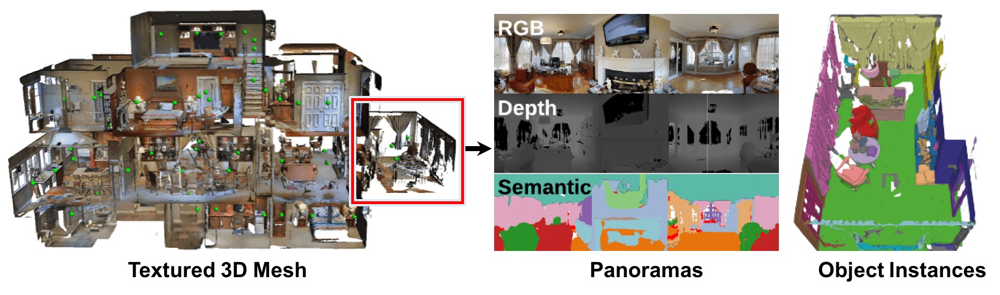

# Matterport3D



The Matterport3D V1.0 dataset contains data captured throughout 90 properties with a Matterport Pro Camera.

This repository includes the raw data for the dataset plus derived data, annotated  data, and scripts/models for several scene understanding tasks.

Visit the main [website](https://niessner.github.io/Matterport) for updates and to browse the data.

## Paper

[**Matterport3D: Learning from RGB-D Data in Indoor Environments**](https://arxiv.org/abs/1709.06158)

If you use the Matterport3D data or code please cite:

```
@article{Matterport3D,
  title={{Matterport3D}: Learning from {RGB-D} Data in Indoor Environments},
  author={Chang, Angel and Dai, Angela and Funkhouser, Thomas and Halber, Maciej and Niessner, Matthias and Savva, Manolis and Song, Shuran and Zeng, Andy and Zhang, Yinda},
  journal={International Conference on 3D Vision (3DV)},
  year={2017}
}
```

## Data

The dataset consists of several types of annotations: color and depth images, camera poses, textured 3D meshes, building floor plans and region annotations, object instance semantic annotations.  For details see the [data organization](data_organization.md) document.

To download the dataset, you must indicate that you agree to the terms of use by signing the [Terms of Use](http://kaldir.vc.in.tum.de/matterport/MP_TOS.pdf) agreement form and sending it to: [matterport3d@googlegroups.com](mailto:matterport3d@googlegroups.com).  We will then provide download access to the dataset.


## Benchmark tasks

Using the Matterport3D data, we present several benchmark tasks: image keypoint matching, view overlap prediction, surface normal estimation, region type classification, and semantic voxel labeling.  See the [tasks](tasks) directory for details.


## Tools

We provide code for loading and viewing the data.  See the [code](code) directory for details.

## License

The data is released under the [Matterport3D Terms of Use](http://kaldir.vc.in.tum.de/matterport/MP_TOS.pdf), and the code is released under the MIT license.

